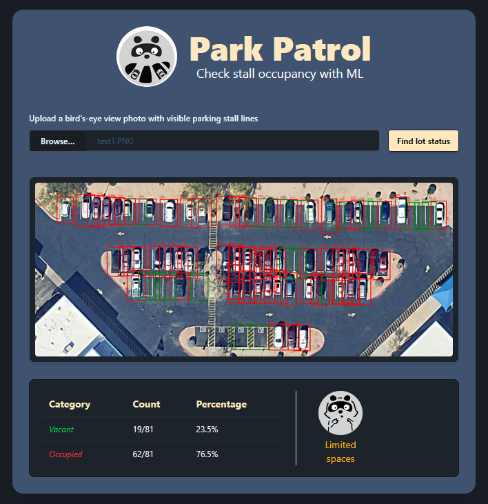

# Welcome to ParkPatrol

## Overview

Park Patrol is an AI-powered parking lot occupancy system. This project has 2 parts:

1. A web application that allows users to upload photos to interact with the
  model.
2. A backend server that has an API to interact with the model.

## Prerequisites

Before starting, make sure you have the following installed:
- Python 3.11 (recommended)
- pip (comes with Python)
- Node.js (LTS version recommended)
- npm (comes with Node.js)
- (optional, for containerized setup) Docker and docker-compose

This project was developed and tested with `python 3.11`. There might be
deprecated warning for usage of `cgi`.

## Setup

#### 1. Install python dependencies:

```sh
pip install -r requirements.txt
```

#### 2. Install front-end dependencies:

```sh
cd front-end
npm i
```

## Running the Application

You can run the full application either locally or using Docker.

### Option 1: Running the Application Locally

#### 1. Start the backend python server:

```sh
python server.py
```

You will have a web server running on port `8000`.

#### 2. Start the web application in `./front-end`:

``` sh
cd front-end
npm run dev
```
Your web application will be running on port `5173`.

#### 3. Use the application:

1. Open your browser and go to http://localhost:5173
2. Click Browse in the file input.
3. Select a parking lot image.
    Test images are available in ./data/images/test/
4. Click Submit.

The application will display:
- An annotated image with detected stalls marked and labeled.
- Metrics for the occupancy classification and count.



### Option 2: Running the Application with Docker

1. Run the entire project with:
```sh
docker-compose up
```

2. To stop the application, just run:

```sh
docker-compose down
```
